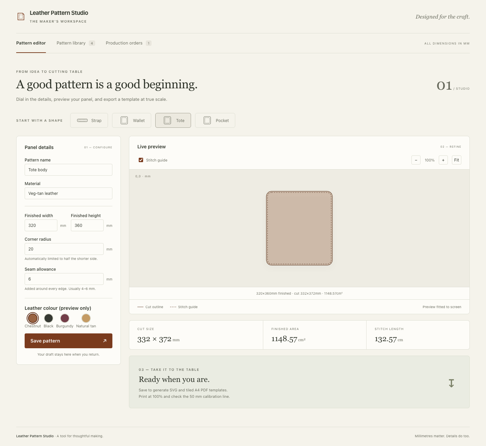

# Leather Pattern Studio

A full-stack workspace for designing leather cutting patterns and tracking workshop production. Built around the panel-drafting workflow of [My Star Georgia](https://mystar.ge).

Enter finished dimensions, a corner radius and a seam allowance. The studio draws the cutting outline and stitch guide instantly, saves the server-validated pattern, and generates SVG and true-scale A4 PDF templates. Large panels are tiled across pages with a 10 mm overlap and a 50 mm calibration ruler.



## Features

- Responsive React + TypeScript editor with strap, wallet, tote and pocket presets.
- Exact dimensions in millimetres, automatic corner-radius limits, calculated cut size, area and stitch length.
- Leather colour preview, stitch-guide toggle, zoom controls and local draft recovery.
- Persistent, searchable pattern library with pagination, reopening, downloads and confirmed deletion.
- Immutable saved patterns: adjustments create a new pattern, preserving dimensions referenced by existing orders.
- Production orders with quantities and notes; enforced received → in production → shipped transitions.
- SVG and tiled A4 PDF exports, automatic status polling, export-failure recovery and atomic file writes.
- FastAPI REST endpoints, OpenAPI documentation and consistent validation/error responses.
- Redis/RQ export processing, PostgreSQL in Docker, and a SQLite/inline mode for easy local demos.
- Reusable accessible React controls, shared Python/TypeScript geometry fixtures, browser workflow and accessibility checks.
- A separate read-only Flutter companion viewer using the same REST API.

## Quick start

Requires **Node.js 22.12+** and **Python 3.11+**. Run these commands from the repository root:

```bash
npm run setup
npm run dev
```

Open **http://localhost:5173**. API documentation is at **http://localhost:8000/docs**. The setup script installs the root browser-testing tools, both JavaScript packages, and the Python API into `apps/api/.venv`.

No database server or Redis is needed for this mode. Patterns persist in `apps/api/patterns.db`; generated templates are in `apps/api/exports/`. Stop both services with Ctrl+C.

If a port is occupied:

```bash
API_PORT=8001 WEB_PORT=5173 npm run dev
```

The frontend proxy automatically follows the selected API port. If your system's `python3` is older than 3.11, use `python3.12 scripts/setup.py` and `python3.12 scripts/dev.py` instead.

## Run the service stack

With Docker and the Compose plugin installed:

```bash
docker compose up --build
```

The web app remains at **http://localhost:5173**. Compose builds the frontend and serves it with Nginx, proxies `/api` to FastAPI, and runs PostgreSQL, Redis and a separate export worker. Database and export volumes persist across restarts. Stop with `docker compose down`.

```bash
# Scale export processing independently of the API
docker compose up --scale worker=2
```

See [Deployment](docs/DEPLOYMENT.md) for configuration and the scope of a portfolio deployment.

## Verify it

After `npm run setup`:

```bash
npm test                       # React components, accessibility and frontend behavior
npm run test:api                # REST, geometry, jobs and PDF regression checks
npm run build                  # TypeScript check and production build
npm run format:check            # TypeScript/CSS formatting
apps/api/.venv/bin/ruff check apps/api apps/worker packages/core_py scripts
apps/api/.venv/bin/ruff format --check apps/api apps/worker packages/core_py scripts

npx playwright install chromium --no-shell
npm run screenshots             # Disposable sample data; refreshed portfolio previews
npm run test:e2e                # Real API workflows at desktop and phone sizes
```

Browser tests launch their own services on ports 18000 and 15173, with temporary databases and exports. They do not modify your local pattern library. CI runs the tests and production build, plus Flutter analysis/tests/build and a Docker service smoke test.

## Flutter companion

Requires a Flutter SDK. From `apps/mobile_flutter`:

```bash
flutter pub get
flutter test
flutter analyze
flutter run -d web-server --web-port 8080 \
  --dart-define=API_BASE_URL=http://localhost:8000/api/v1
```

Allow that origin in the API when running the browser companion:

```bash
CORS_ORIGINS=http://localhost:5173,http://localhost:8080 npm run dev
```

The companion loads a pattern by ID and renders its saved SVG. This repository includes the web entry point. To generate native Android/iOS project wrappers, run `flutter create --platforms=android,ios .` inside the companion directory with the corresponding platform toolchains installed. Use your computer's LAN address for the API when running on a physical device.

## Project layout

| Path | Responsibility |
| --- | --- |
| `apps/web` | Pattern editor, library and production workspace |
| `packages/ui` | Accessible native React controls and design tokens |
| `apps/api` | Versioned FastAPI API, validation and persistence |
| `packages/core_py` | Geometry, database models and export rendering |
| `apps/worker` | Independent Redis/RQ worker |
| `apps/mobile_flutter` | Read-only companion viewer |
| `fixtures` | Shared geometry contract for Python and TypeScript |
| `e2e` | Browser workflows and WCAG accessibility checks |
| `scripts` | Setup, local service runner and isolated browser-test runner |

[Verification record](docs/VERIFICATION.md) · [Architecture](ARCHITECTURE.md) · [API contract](docs/API.md) · [Contributing](CONTRIBUTING.md)

## Scope

The complete workflow covers rectangular and rounded-rectangle panels. Presets are individual panels, not complete multi-piece bag patterns. The colour choice is visual only. Orders track workshop progress and do not process payments or shipping labels. There is no user-account system: this is a local/shared workshop and portfolio app, not a multi-tenant service.

## License

MIT — see [LICENSE](LICENSE).
